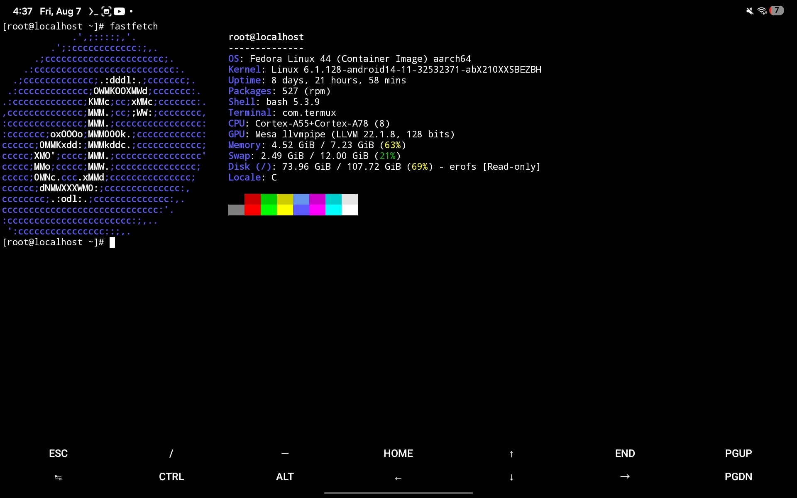

# Fedora 44 on Termux (Android Emulation)

A automated script to install and run a **Fedora 44 session on Android** using proot.

Preview:
    
    

Uses official Linux Containers rootfs with `tigervnc-server` setup on first boot. 

---

## Installation

Open **Termux** and run **one** of the following commands to install Fedora 44:

### Using `wget`
```
wget -qO- "https://raw.githubusercontent.com/Shedeggsky/fedora-on-android/main/install.sh" | bash
```

## Installation with LXQt (Testing)
### Using `wget`
```
wget -qO- "https://raw.githubusercontent.com/Shedeggsky/fedora-on-android/main/install-lxqt.sh" | bash
```
## Tips

### How to Run
Once installation finishes, launch Fedora from your Termux home directory anytime:
```
./fedora.sh
```
### Exit Command
To exit back to Termux from inside Fedora, simply type:
```
exit
```
### To update and install packages
To update all packages, use this command.
```
dnf update -y
```

To install packages, use this command.
```
dnf install <package>
```
To find packages, you can either search on Google or https://packages.fedoraproject.org/.
